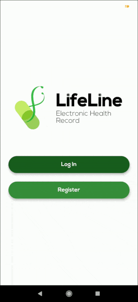

# LifeLine
 

LifeLine is an Electronic Health Record application made using Flutter and Firebase Firestore.

# Showcase

### Login and Main Menu

### Medical History

### Blood Donation

### Health Record

